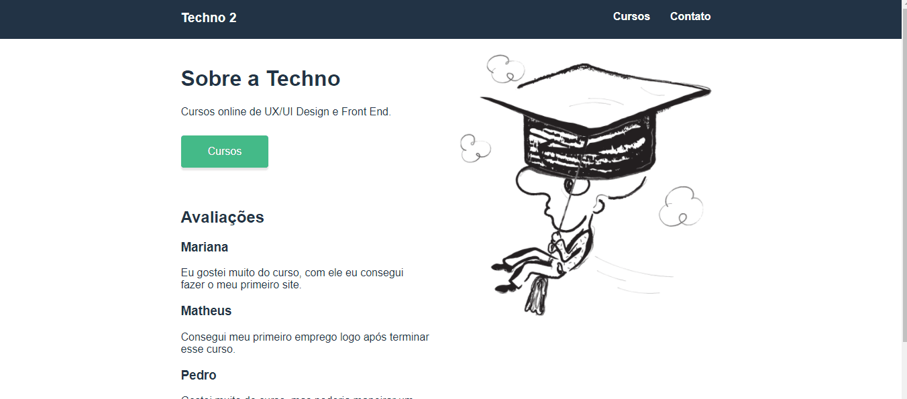

# techno-2

<h1 align="center">Sobre o projeto</h1>

Segundo projeto do curso de Vue.js da origamid para colocar em pratica os conhecimentos sobre vue router.

<h2 align="center">Tecnologias Utilizadas</h2>

Foram utilizados HTML, CSS e Vue.

Com esse projeto pude aprender:

<ul>
  <li>Entender melhor sobre componentes.</li>
  <li>Praticar a utilização do vue router.</li>
  <li>Aprendi a criar um mixin para reutilizar código.</li>
  <li>Aprender a utilizar o json server</li>
</ul>
 

<h2 align="center"> Como utilizar esse projeto </h2>

 Para utilizar o projeto em seu computador é necessário ter instalado: 

<ul>
  <li>Node.js</li>
  <li>
    
Git para utilizar o comando:

    
git clone https://github.com/Hamilton-junior/weatherApp.git

  </li>
  <li>
    
Editor de código.

  </li>
  <li>
    
 JSON Server 

    
 Você pode instalar ele de forma global através do comando: <strong>npm install -g json-server</strong>.

  </li>
</ul>
<h3 align="center"> Rodando o projeto </h3>

Ao abrir o projeto no seu editor, utilize o comando: <strong>npm install</strong> para instalar as dependências do projeto.

Retire de dentro de public a pasta api e coloque em algum lugar do seu computador pois dentro dela possui o arquivo contendo os dados utilizados.

 Acessando a pasta da api através do terminal, rode o comando: <strong>json-server --watch api.json</strong> para utilizar o json server.

 Depois de ter iniciado o json server, acessando a pasta do projeto através do terminal, digite o seguinte comando: <strong>npm run serve</strong> para iniciar o projeto vue. Depois só pegar o link do localhost que será mostrado no terminal e acessar através do navegador.

<h2 align="center">Autor</h2>

<strong> Hamilton de Souza </strong>
 

